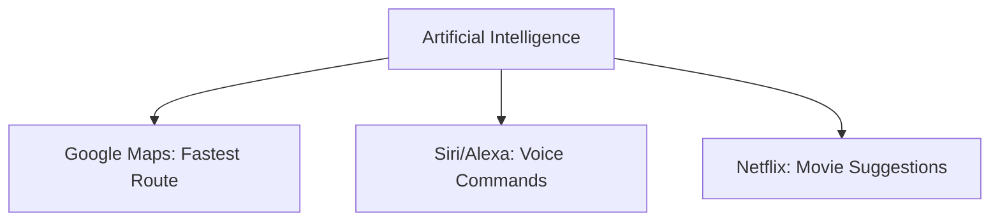
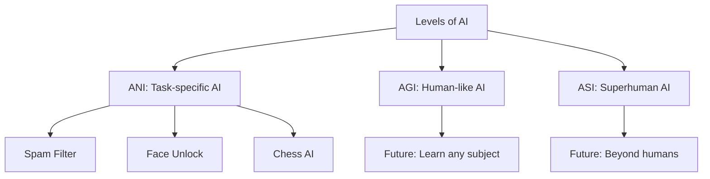
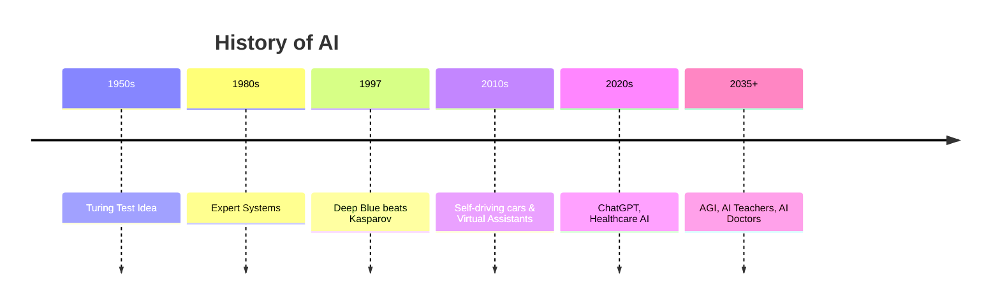
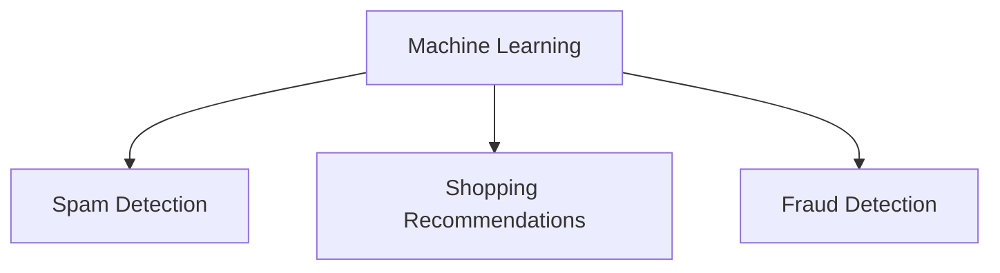
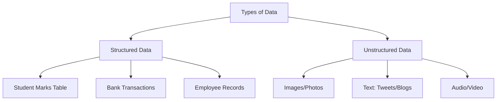
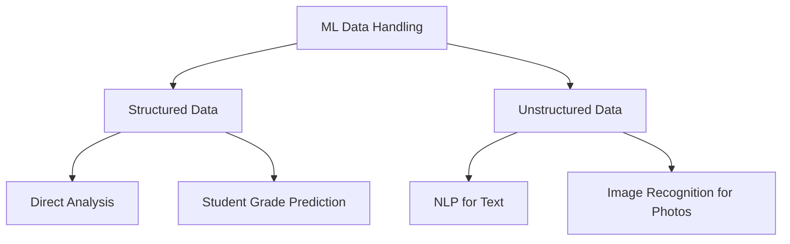
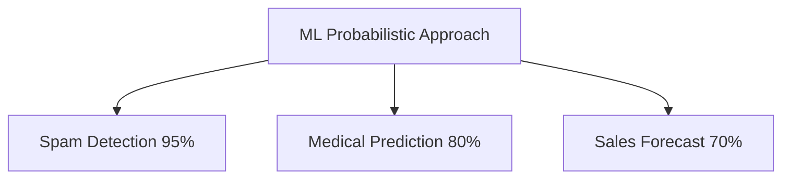
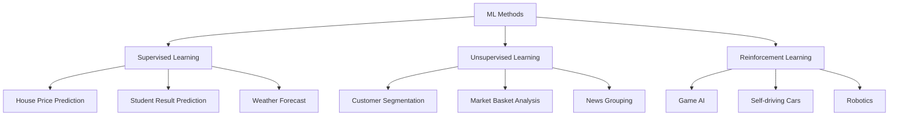
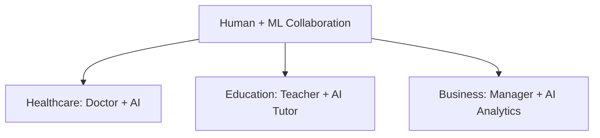

# 🤖 Artificial Intelligence & Machine Learning (Beginner Module)

This is your **first learning module** on Artificial Intelligence (AI) and Machine Learning (ML). Everything is explained with **examples and flowcharts** so you can easily understand.

---

## 1. 🌟 What is Artificial Intelligence (AI)?

**Definition:**
AI is the ability of machines to **mimic human intelligence** – to learn, reason, and make decisions.

**Examples:**

1. **Google Maps** → Suggests fastest route.
2. **Alexa / Siri** → Understands voice commands.
3. **Netflix** → Recommends shows you might like.

---

## 2. 🔑 Levels of Artificial Intelligence

1. **Artificial Narrow Intelligence (ANI)** – Focused on a single task.

   * Example: Spam filter, Face unlock, Chess-playing AI.

2. **Artificial General Intelligence (AGI)** – Human-like intelligence.

   * Example: A future system that can learn **any subject** like a human.

3. **Artificial Super Intelligence (ASI)** – Beyond human intelligence.

   * Example: Future possibility – machines smarter than humans in everything.

---

## 3. 📜 History of AI

* **Past:** (1950–2000) – Rule-based logic & first experiments.

  * Example: Turing Test, Expert systems, Deep Blue chess.
* **Present:** (2000–Now) – AI in daily life.

  * Example: ChatGPT, Self-driving cars, Fraud detection.
* **Future:** – Possible AGI/ASI.

  * Example: AI doctors, Fully autonomous cities, AI teachers.

---

## 4. 📘 Machine Learning (ML)

**Definition:**
ML is a branch of AI where machines **learn from data and improve with experience**.

**Examples:**

1. Email → Spam vs. not spam.
2. E-commerce → “People also bought” suggestions.
3. Banks → Fraud detection in transactions.

---

## 5. 🗂️ Data in ML

### Structured Data

* Organized in rows and columns.
* Examples:

  1. Excel sheet of students’ marks.
  2. Bank account transaction history.
  3. Employee database.

### Unstructured Data

* No fixed format.
* Examples:

  1. Images (Instagram photos).
  2. Free text (tweets, blogs).
  3. Audio/Video files.

---

## 6. ⚙️ How ML Structures Data

* **Structured Data:** Already in tables, easy to analyze.

  * Example: Predict student pass/fail from marks.
* **Unstructured Data:** Needs processing → NLP, Image recognition.

  * Example: Detect spam words in emails, Identify cats in photos.

---

## 7. 🎲 Probabilistic Calculations

ML gives **probability-based answers**, not 100% certainty.

**Examples:**

1. Email is **95% spam**.
2. Patient has **80% chance of diabetes**.
3. Product will sell with **70% probability**.

---

## 8. 📊 Methods ML Uses to Analyze Data

1. **Supervised Learning** → Learns from labeled data.

   * Examples:

     * Predicting house prices.
     * Predicting student exam results.
     * Weather forecast.

2. **Unsupervised Learning** → Finds hidden patterns.

   * Examples:

     * Customer segmentation.
     * Market basket analysis (which products sell together).
     * Grouping news articles.

3. **Reinforcement Learning** → Learns by trial & error with rewards.

   * Examples:

     * Game-playing AI (Chess, Go).
     * Self-driving cars.
     * Robot learning to walk.

---

## 9. 🤝 Ideal Human + ML Relationship

Humans + ML together = Best results.

**Examples:**

1. **Healthcare** → Doctor + AI diagnosis = Faster, accurate treatment.
2. **Education** → Teacher + AI tutor = Personalized learning.
3. **Business** → Manager + AI analytics = Smarter decisions.

---

## ✅ Quick Recap

* **AI** = Smart machines (Siri, Netflix).
* **ML** = Learning from data (Spam filter, Fraud detection).
* **Structured Data** = Tables (Student marks).
* **Unstructured Data** = Photos, Text, Audio.
* **ML Methods** = Supervised, Unsupervised, Reinforcement.
* **Ideal Future** = Humans + AI working together.

---
