# 🤖 Artificial Intelligence & Machine Learning (Beginner Module)

This is your **first learning module** on Artificial Intelligence (AI) and Machine Learning (ML). Everything is explained with **examples and flowcharts** so you can easily understand.

---

## 1. 🌟 What is Artificial Intelligence (AI)?

**Definition:**
AI is the ability of machines to **mimic human intelligence** – to learn, reason, and make decisions.

**Examples:**

1. **Google Maps** → Suggests fastest route.
2. **Alexa / Siri** → Understands voice commands.
3. **Netflix** → Recommends shows you might like.

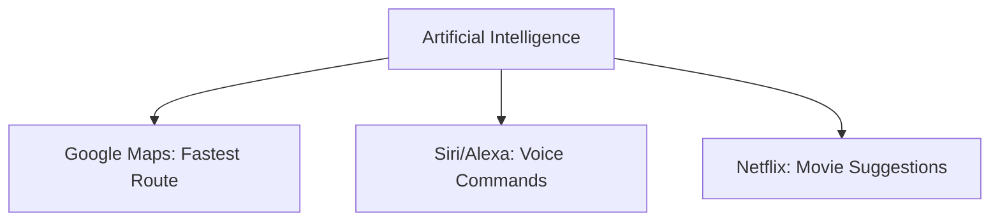

---

## 2. 🔑 Levels of Artificial Intelligence

1. **Artificial Narrow Intelligence (ANI)** – Focused on a single task.

   * Example: Spam filter, Face unlock, Chess-playing AI.

2. **Artificial General Intelligence (AGI)** – Human-like intelligence.

   * Example: A future system that can learn **any subject** like a human.

3. **Artificial Super Intelligence (ASI)** – Beyond human intelligence.

   * Example: Future possibility – machines smarter than humans in everything.

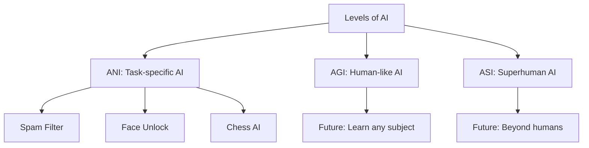

---

## 3. 📜 History of AI

* **Past:** (1950–2000) – Rule-based logic & first experiments.

  * Example: Turing Test, Expert systems, Deep Blue chess.
* **Present:** (2000–Now) – AI in daily life.

  * Example: ChatGPT, Self-driving cars, Fraud detection.
* **Future:** – Possible AGI/ASI.

  * Example: AI doctors, Fully autonomous cities, AI teachers.

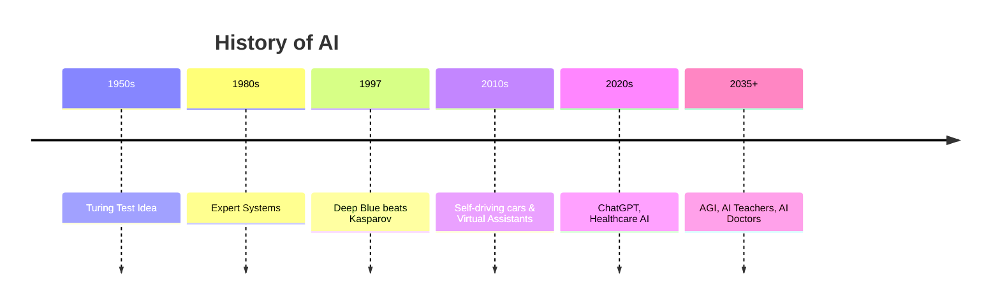

---

## 4. 📘 Machine Learning (ML)

**Definition:**
ML is a branch of AI where machines **learn from data and improve with experience**.

**Examples:**

1. Email → Spam vs. not spam.
2. E-commerce → “People also bought” suggestions.
3. Banks → Fraud detection in transactions.

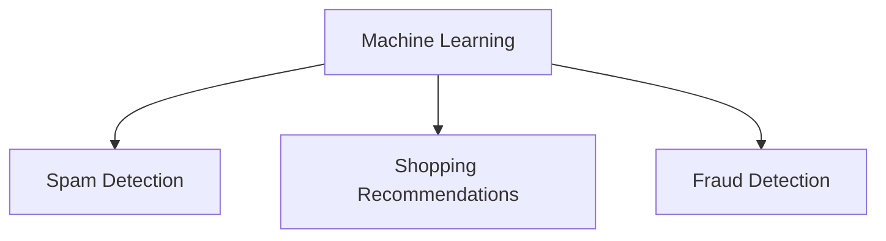

---

## 5. 🗂️ Data in ML

### Structured Data

* Organized in rows and columns.
* Examples:

  1. Excel sheet of students’ marks.
  2. Bank account transaction history.
  3. Employee database.

### Unstructured Data

* No fixed format.
* Examples:

  1. Images (Instagram photos).
  2. Free text (tweets, blogs).
  3. Audio/Video files.

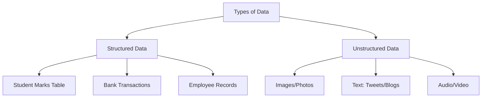

---

## 6. ⚙️ How ML Structures Data

* **Structured Data:** Already in tables, easy to analyze.

  * Example: Predict student pass/fail from marks.
* **Unstructured Data:** Needs processing → NLP, Image recognition.

  * Example: Detect spam words in emails, Identify cats in photos.

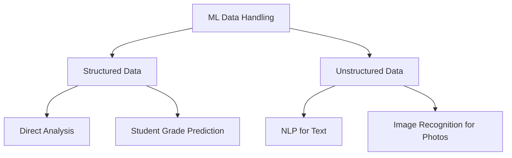

---

## 7. 🎲 Probabilistic Calculations

ML gives **probability-based answers**, not 100% certainty.

**Examples:**

1. Email is **95% spam**.
2. Patient has **80% chance of diabetes**.
3. Product will sell with **70% probability**.

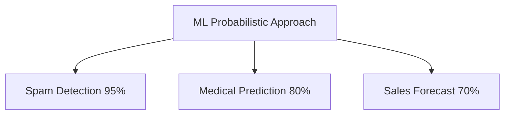

---

## 8. 📊 Methods ML Uses to Analyze Data

1. **Supervised Learning** → Learns from labeled data.

   * Examples:

     * Predicting house prices.
     * Predicting student exam results.
     * Weather forecast.

2. **Unsupervised Learning** → Finds hidden patterns.

   * Examples:

     * Customer segmentation.
     * Market basket analysis (which products sell together).
     * Grouping news articles.

3. **Reinforcement Learning** → Learns by trial & error with rewards.

   * Examples:

     * Game-playing AI (Chess, Go).
     * Self-driving cars.
     * Robot learning to walk.

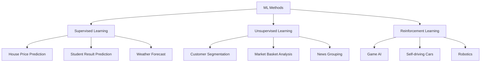

---

## 9. 🤝 Ideal Human + ML Relationship

Humans + ML together = Best results.

**Examples:**

1. **Healthcare** → Doctor + AI diagnosis = Faster, accurate treatment.
2. **Education** → Teacher + AI tutor = Personalized learning.
3. **Business** → Manager + AI analytics = Smarter decisions.

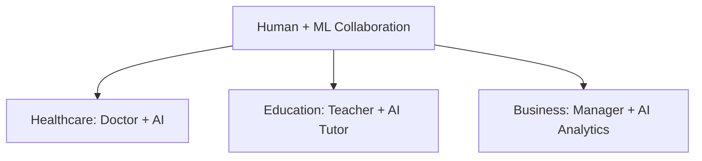

---

## ✅ Quick Recap

* **AI** = Smart machines (Siri, Netflix).
* **ML** = Learning from data (Spam filter, Fraud detection).
* **Structured Data** = Tables (Student marks).
* **Unstructured Data** = Photos, Text, Audio.
* **ML Methods** = Supervised, Unsupervised, Reinforcement.
* **Ideal Future** = Humans + AI working together.

---

# MODULE - 2

# 🤖 AI, NLP, and Computer Vision – Concepts & Workflows

This document explains the fundamentals of **Natural Language Processing (NLP)**, **Chatbots**, and **Computer Vision**, along with workflows using **Mermaid diagrams**.

---

## 📌 1. Natural Language Processing (NLP)

**Definition:**
NLP is a branch of AI that allows computers to understand, process, and generate human language.

**Steps involved:**

1. Input (Text/Speech)
2. Preprocessing (Tokenization, Stop-word removal, Lemmatization)
3. Feature Extraction (Word Embeddings, TF-IDF, BERT)
4. Modeling (Machine Learning/Deep Learning)
5. Output (Sentiment, Intent, Summary, Translation)

**Example:**

* Input: *"I need a cab to the airport"*
* Output: Intent = *Book Ride*, Entity = *Airport*

**Workflow:**

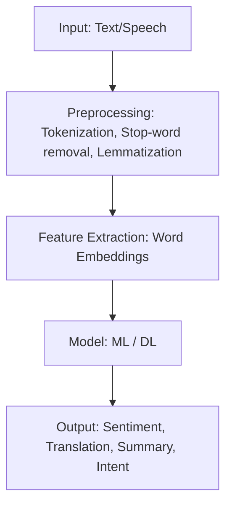

---

## 📌 2. How AI uses NLP to Derive Meaning

AI converts unstructured text into structured data for analysis.

**Example:**
*"I love pizza but hate burgers"* →
Positive sentiment = Pizza | Negative sentiment = Burgers

**Workflow:**

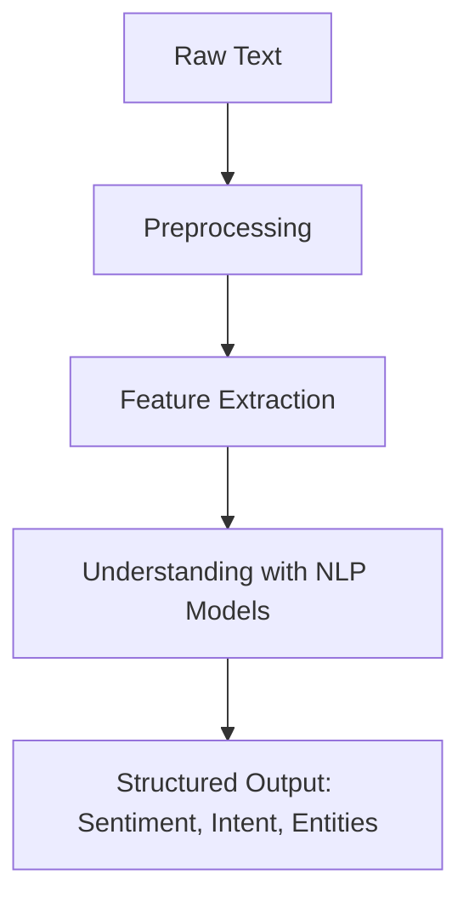

---

## 📌 3. Classification Problem & Solutions

**Definition:** Classification is the task of categorizing data into predefined classes.

**Examples:**

* Spam Detection (Spam / Not Spam)
* Sentiment Analysis (Positive / Negative / Neutral)

**Solutions:**

* Logistic Regression
* Decision Trees
* Naïve Bayes
* Deep Learning (CNNs, RNNs, Transformers)

**Workflow:**

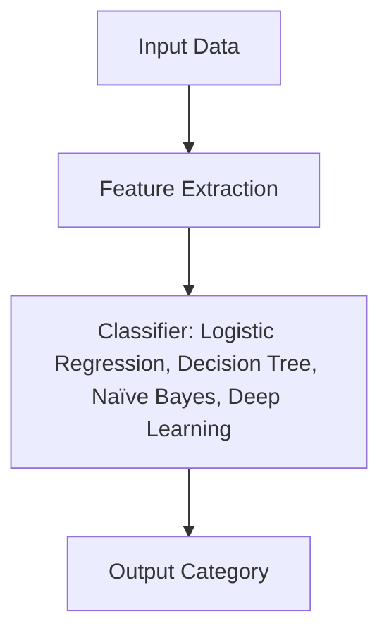

---

## 📌 4. How a Chatbot Works

**Process:**

1. **Understand**: Extracts intent & entities using NLP
2. **Reason**: Chooses best action using rules/ML
3. **Learn**: Improves from feedback
4. **Interact**: Generates a human-like response

**Example:**
User: *"Book a flight to Delhi for tomorrow"*

* Intent = Book Flight
* Entities = Destination=Delhi, Date=Tomorrow

**Workflow:**

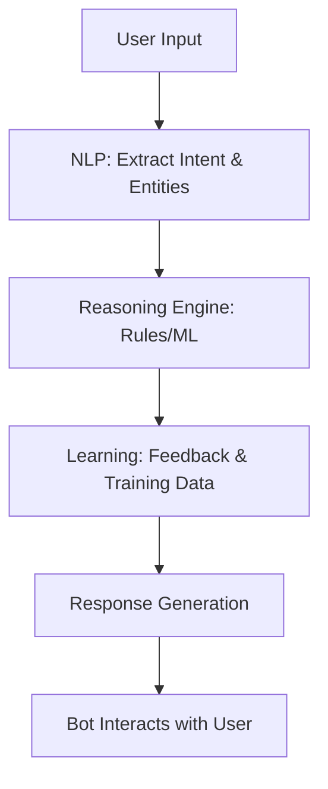

---

## 📌 5. Intents, Entities, and Dialogs

* **Intent:** The goal of the user (*BookFlight, CheckWeather*)
* **Entity:** Specific details in the request (*City=Delhi, Date=Tomorrow*)
* **Dialog:** Flow of conversation between bot and user

**Example:**
*"Book a flight to Mumbai on Monday"* →
Intent = BookFlight | Entity = City=Mumbai, Date=Monday | Dialog = Bot asks: *“What time do you prefer?”*

**Workflow:**

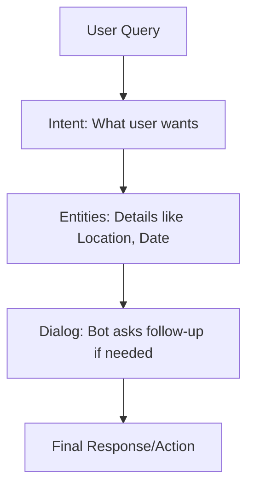

---

## 📌 6. Appropriate Uses for Chatbots

**Good use cases:**

* Customer support
* Online shopping assistance
* Banking (balance inquiry, fund transfer)
* Healthcare (symptom checkers)
* Education (learning assistants)

**Not suitable:**

* Tasks requiring deep empathy (therapy, legal advice)

**Workflow:**

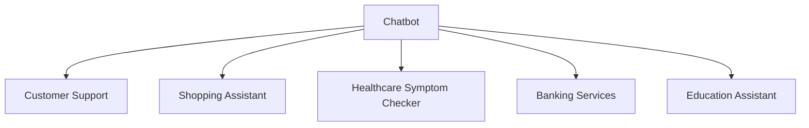

---

## 📌 7. Real-world Uses of NLP

**Applications:**

* Sentiment Analysis → Twitter/Facebook opinions
* Machine Translation → Google Translate
* Speech Recognition → Siri, Alexa
* Text Summarization → News digest
* Resume Parsing → Job portals

**Workflow:**

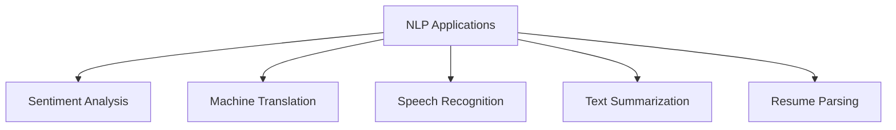

---

## 📌 8. How AI Classifies Images

**Steps:**

1. Input Image
2. Preprocessing (resize, normalize)
3. Feature Extraction (CNN layers)
4. Classification (model prediction)

**Example:**
🐶 → CNN → Output = Dog

**Workflow:**

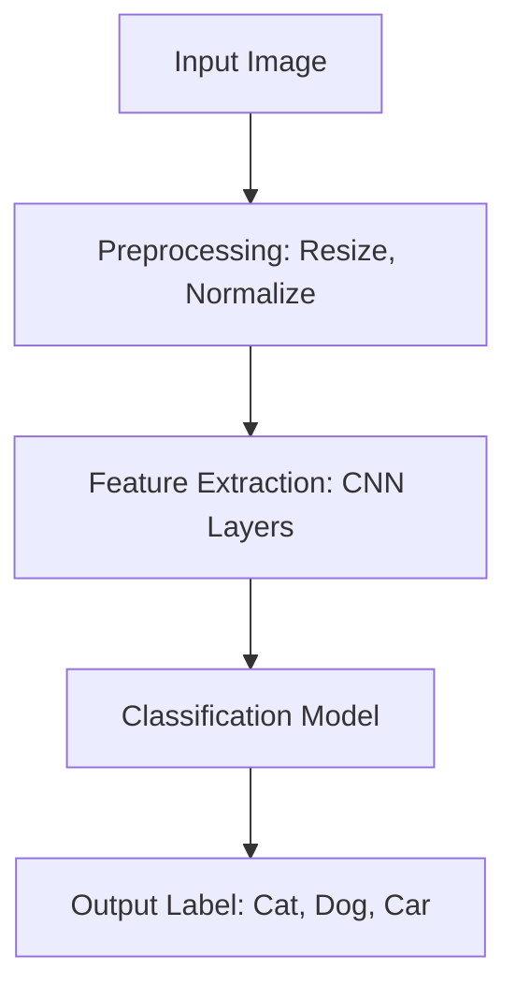

---

## 📌 9. CNN Image Analysis

**Layers:**

* Convolution → Detects features (edges, textures)
* Pooling → Reduces noise & size
* Fully Connected → Final classification

**Workflow:**

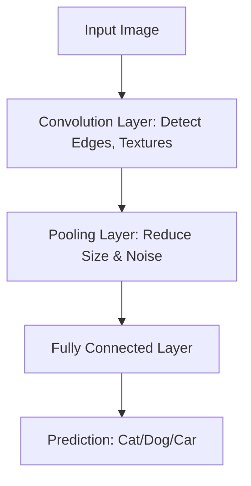

---

## 📌 10. GAN – Generating Images

**How it works:**

* Generator creates fake images
* Discriminator checks real vs fake
* Training continues until fake images look real

**Example:** Fake celebrity photos (deepfakes).

**Workflow:**

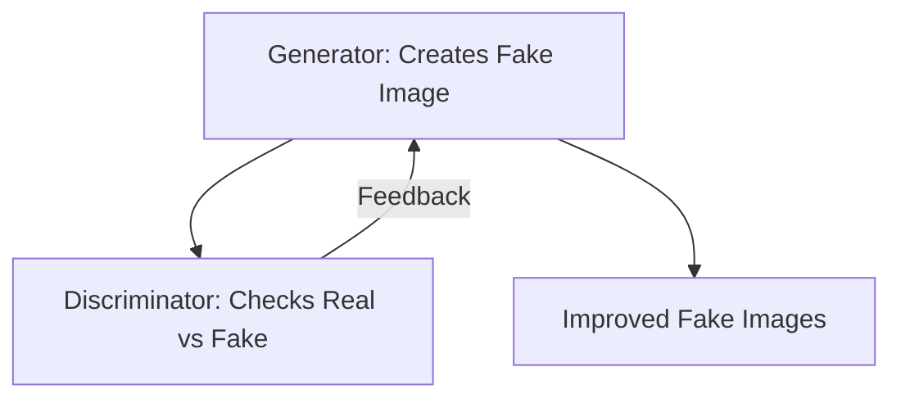

---

## 📌 11. Computer Vision Real-world Uses

**Applications:**

* Healthcare → Tumor detection in X-rays
* Self-driving Cars → Object & pedestrian detection
* Security → Face recognition
* Retail → Automated checkout

**Workflow:**

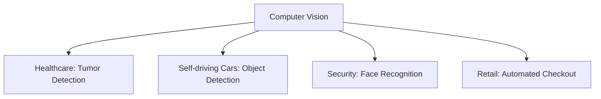

---

# ✅ Summary

* **NLP** → Makes sense of text (chatbots, translation, sentiment)
* **Classification** → Assigns categories (spam detection, sentiment)
* **Chatbots** → Understand, reason, learn, and interact with users
* **CNN** → Analyzes images to detect patterns and classify objects
* **GANs** → Create new realistic images
* **Computer Vision** → Applies AI to images for healthcare, security, self-driving cars

---

# 🎯 Practical NLP Activities

### **1. Sentiment Analysis with Text Samples**

* **Objective:** Understand how NLP detects emotions in text.
* **Activity:**

  * Students write short sentences (e.g., *"I love this movie!"*, *"This food is terrible."*).
  * Use a free Sentiment Analysis tool (ChatGPT, Gemini, or API Ninja sentiment API).
  * Tool will classify the text as **Positive / Negative / Neutral**.
* **Learning Outcome:** Students see how AI "reads" emotions in text.

---

### **2. Named Entity Recognition (NER) – Finding Entities**

* **Objective:** Learn how AI identifies important info in text.
* **Activity:**

  * Students take a short news article or sentence:
    *"Virat Kohli scored a century in Mumbai against Australia."*
  * Paste it into ChatGPT, Gemini, or API Ninja NER API.
  * Tool will highlight **Entities**: (*Virat Kohli → Person, Mumbai → Location, Australia → Country*).
* **Learning Outcome:** Students realize how AI extracts useful information automatically.

---

### **3. Text Summarization Game**

* **Objective:** See how NLP condenses large text.
* **Activity:**

  * Take a paragraph from a story or article.
  * Students summarize it in **one sentence**.
  * Compare with AI-generated summary (ChatGPT/Gemini).
* **Learning Outcome:** Students understand how AI compresses knowledge and compare it with their own reasoning.

---

# MODULE - 3 

# 📘 AI, ML & DL Concepts with Flowcharts & Examples

---

## 1. Difference between **AI, ML, and DL**

```mermaid
flowchart TD
    A[Artificial Intelligence] --> B[Machine Learning]
    B --> C[Deep Learning]
    A --> D[Expert Systems, Robotics, Chatbots]
    B --> E[Spam Detection, Recommendations]
    C --> F[Face Recognition, Self-driving Cars]
```

**Examples:**

* AI → Chess-playing program
* ML → Netflix recommending movies
* DL → Google Photos tagging faces

---

## 2. Learning Types

```mermaid
flowchart TD
    A[Learning Types] --> B[Supervised Learning]
    A --> C[Unsupervised Learning]
    A --> D[Reinforcement Learning]

    B --> B1[Input + Correct Output]
    C --> C1[Find Hidden Patterns]
    D --> D1[Trial and Error with Rewards]

    B1 --> B2[Example: Predict house price]
    C1 --> C2[Example: Customer Clustering]
    D1 --> D2[Example: Robot Walking]
```

---

## 3. Algorithms

### Decision Tree

```mermaid
flowchart TD
    A[Weather] -->|Sunny| B[Play Outside]
    A -->|Rainy| C[Stay Home]
```

*Example:* If weather is Sunny → Play, else Stay home.

### Linear Regression

```mermaid
flowchart TD
    A[Hours Studied] --> B[Line Equation Y = mX+c]
    B --> C[Predicted Score]
```

*Example:* More study hours → higher marks.

### Logistic Regression

```mermaid
flowchart TD
    A[Study Hours] --> B[Sigmoid Function]
    B --> C[Pass/Fail Probability]
```

*Example:* Predict if student passes (Yes/No).

---

## 4. Flow of Info in a **Perceptron**

```mermaid
flowchart LR
    X1[Input 1: Hours Studied] --> W1((Weight 1))
    X2[Input 2: Sleep Hours] --> W2((Weight 2))
    W1 --> S[Summation + Bias]
    W2 --> S
    S --> A[Activation Function]
    A --> O[Output: Pass/Fail]
```

*Example:* Inputs (Hours studied, sleep hours) → Weighted sum → Activation → Output (Pass/Fail).

---

## 5. ML’s Trial-and-Error Learning

```mermaid
flowchart TD
    A[Model Guess] --> B[Check Error]
    B --> C[Adjust Weights]
    C --> D[Try Again]
    D --> A
```

*Example:* Child learning to ride → falls → adjusts balance → tries again.

---

## 6. Deep Learning Ecosystem

```mermaid
flowchart TD
    A[Deep Learning] --> B[Frameworks: TensorFlow, PyTorch]
    A --> C[Hardware: GPU, TPU]
    A --> D[Big Data: Images, Text, Audio]
    A --> E[Applications: NLP, Vision, Speech]
```

*Example:* Alexa uses → Data (Voice) + Frameworks + GPUs → Gives answer.

---

## 7. Real-world Applications

```mermaid
flowchart TD
    A[Deep Learning Applications] --> B[Self-driving Cars]
    A --> C[Medical Diagnosis]
    A --> D[Chatbots]
    A --> E[Fraud Detection]
```

---

## 8. Future Trends in ML

```mermaid
flowchart TD
    A[Future ML Trends] --> B[Explainable AI]
    A --> C[AI on Edge Devices]
    A --> D[Human-AI Collaboration]
    A --> E[AutoML Tools]
```

---

# 🎯 Interactive Activities (linked to flowcharts)

1. **AI/ML/DL Sorting Game** – Show flowchart examples, students classify them.
2. **Decision Tree Role Play** – One student = root, others = branches → final decision at leaves.
3. **Perceptron Math Challenge** – Students calculate output step-by-step.
4. **Trial-and-Error Game** – Blindfold navigation with rewards (claps).
5. **Ecosystem Puzzle** – Give “data, framework, hardware” cards → students arrange into ecosystem flow.

---


# MODULE - 5 

# 📘 AI Ethics & Responsible AI – README

## ❓ Questions & Answers

---

### 1. What are the Five Pillars of AI Ethics?

**Meaning**: Core principles for responsible AI.

* **Fairness** → Equal treatment.
* **Robustness** → Reliable in all conditions.
* **Explainability** → Clear reasons for decisions.
* **Privacy** → Protects user data.
* **Accountability** → Someone responsible.

**Example**: Loan AI must treat men and women equally, protect data, explain rejection reasons, and the company should take responsibility.

```mermaid
flowchart TD
    A[AI Ethics Pillars] --> B(Fairness)
    A --> C(Robustness)
    A --> D(Explainability)
    A --> E(Privacy)
    A --> F(Accountability)
```

---

### 2. What is Fairness in AI?

**Meaning**: Equal treatment for everyone.
**Example**: Hiring AI must not reject women if they are equally skilled.
**Problem**: AI learns from biased history (companies hired more men).
**Solution**: Use diverse, unbiased data.

```mermaid
flowchart TD
    Q[Fairness in AI] --> E[Example: Hiring AI treats all genders equally]
    Q --> P[Problem: Biased historical data]
    Q --> S[Solution: Balanced datasets]
```

---

### 3. What are Protected Attributes?

**Meaning**: Traits AI must not misuse.
**Examples**: Gender, age, race, religion, caste.

```mermaid
flowchart TD
   P[Protected Attributes] --> A[Gender]
   P --> B[Age]
   P --> C[Race]
   P --> D[Religion]
   P --> E[Caste]
```

---

### 4. What are Privileged and Unprivileged Groups?

* **Privileged** → Group with unfair advantage.
* **Unprivileged** → Group with unfair disadvantage.
  **Example**: If AI favors men in promotions →

  * Men = Privileged
  * Women = Unprivileged

```mermaid
flowchart TD
    AI[Promotion AI] --> PR[Privileged: Men]
    AI --> UN[Unprivileged: Women]
```

---

### 5. What is AI Bias?

**Meaning**: AI acting unfairly due to skewed data.
**Example**: Face recognition works better on light skin.
**Problem**: Leads to discrimination.
**Solution**: Use diverse datasets + audits.

```mermaid
flowchart TD
   B[AI Bias] --> E[Example: Face recognition favors light skin]
   B --> P[Problem: Discrimination]
   B --> S[Solution: Diverse data]
```

---

### 6. What is Robustness in AI?

**Meaning**: AI works well even in tricky cases.
**Example**: Spam filter should detect “Fr33 M0ney” as spam.
**Problem**: Small changes trick AI.
**Solution**: Stress test with variations.

---

### 7. What is Adversarial Robustness?

**Meaning**: AI resists deliberate tricks.
**Example**: Car must read a STOP sign even if stickers are added.
**Solution**: Train with adversarial examples.

---

### 8. How can an Adversary Influence AI?

* **Fake data injection** → e.g., fake reviews on Amazon.
* **Tricked input** → e.g., resume stuffed with hidden keywords.

---

### 9. What are Adversarial Attacks?

**Examples**:

* Fake stop sign → Car doesn’t stop.
* Fake voice → AI assistant gives private info.

---

### 10. What is Explainability in AI?

**Meaning**: AI must tell *why* it decided something.
**Example**: Loan AI says: “Rejected → low salary, bad credit score.”

---

### 11. What is the Difference Between Interpretability & Explainability?

* **Interpretability** → Technical view (how model works inside).
* **Explainability** → User view (simple reason).
  **Example**:
* Doctor sees model math = interpretability.
* Patient hears “high sugar level” = explainability.

---

### 12. What is Transparency in AI?

**Meaning**: Being open about how AI works.
**Example**: Social media telling how ads are shown.
**Solution**: Clear policies + disclosures.

---

### 13. What is Governance in AI?

**Meaning**: Rules + responsibility for ethical AI.
**Example**: An ethics committee audits recruitment AI for fairness.

---

### 14. Which Business Roles Handle Transparency?

* **Data Scientist** → Explains AI logic.
* **Manager** → Decides where AI is used.
* **Legal Team** → Ensures laws are followed.
* **Support Team** → Explains results to customers.

---

### 15. What is Personal Information?

**Meaning**: Info identifying a person.
**Examples**: Name, email, phone, address.

---

### 16. What is Sensitive Personal Information?

**Meaning**: Highly private data.
**Examples**: Health, biometrics, religion, finances.
**Problem**: Misuse causes harm (fraud/discrimination).
**Solution**: Encrypt + restrict access.

---

### 17. What is Model Anonymization?

**Meaning**: Hiding real identity in data.
**Example**: “Ravi, 28, Delhi” → “Person A, 28, City.”

---

### 18. What is Differential Privacy?

**Meaning**: Sharing insights without exposing people.
**Example**: Google Maps shows traffic without revealing your exact trip.

---

### 19. What is Data Minimization?

**Meaning**: Collect only what’s needed.
**Example**: Food delivery app needs your address, not your religion.

```mermaid
flowchart TD
   DM[Data Minimization] --> N[Need-to-have Data]
   DM --> A[Example: Address for delivery]
   DM --> X[Don't Collect: Religion]
```

---


